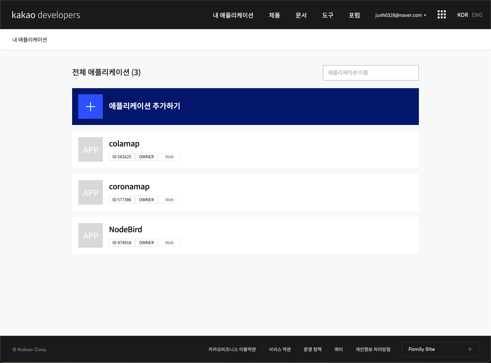
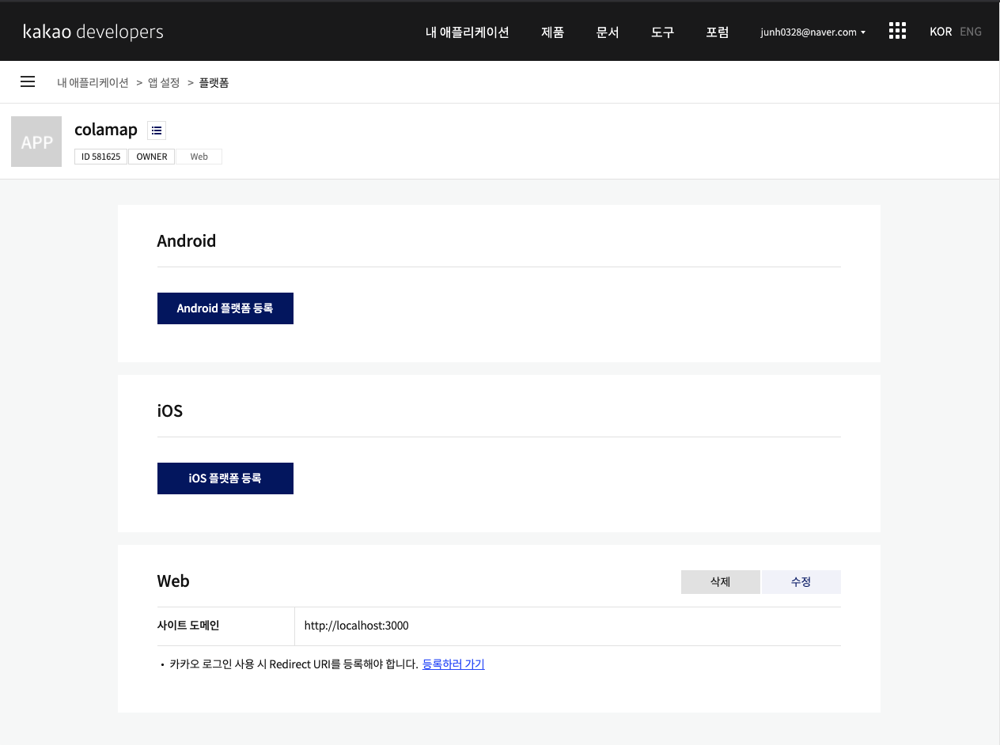
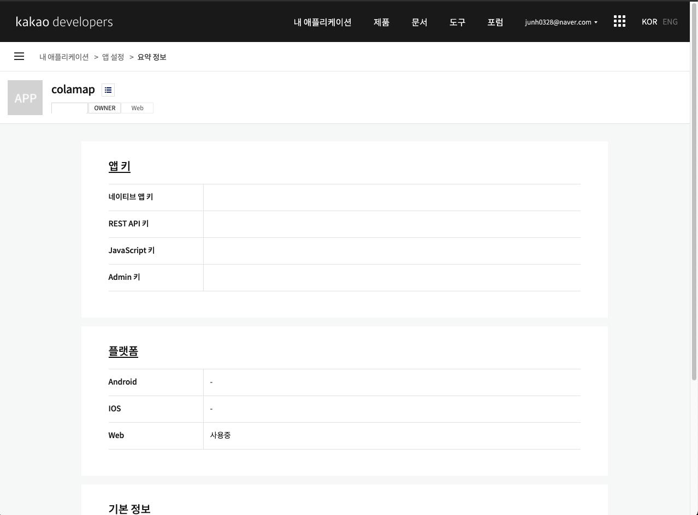

# 실행 방법

## 1. 프론트 폴더에 접근한다
```
🖥 terminal

cd front 
 ```

## 2. package.json 에 들어있는 라이브러리 및 모듈을 다운로드 받는다
```
🖥 terminal

yarn / npm install
```

## 3. 카카오 어플리케이션을 만든다

> <a href="https://developers.kakao.com/">'카카오 developers' </a>에서 애플리케이션을 추가한 후 키를 발급 받아야 합니다.

### 📍 로그인 후에 내어플리케이션 클릭 


### 📍 어플리케이션 추가



###  📍 앱 설정 > 플랫폼 > 웹 사이트 도메인 추가 



### 📍 JavaScript 키 복사



## 4. front 디렉토리에 .env 파일을 생성하고, 발급 받은 JS 환경 변수를 설정한다


```
📁/front/.env

REACT_APP_KAKAO_KEY=자신의 카카오 API 중 JS 라이브러리 키

```

## 5. 실행한다
```
🖥 terminal

yarn run start / npm run start
```