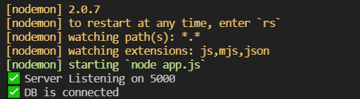

### 💻 서버 실행 방법

config 폴더 내 dev.env 파일 생성 후  
아래와 같이 작성

```
PORT=yourPort
MONGODB_URL=yourMongoUrl
JWT_SECRET=yourJWTSecretKey
```

✔ MONGODB_URL의 경우 슬랙 채널 고정메시지 참고

server 폴더 내에서 실행  
`$ npm install` - 필요 모듈 설치  
`$ npm run dev` - 서버 실행

<br>

### 🖥 서버, DB 정상 실행 시 메시지




<br>
### 문의하기 기능 사용 전 dotenv 설정

>
```
MAIL_USER=colamap.dev@gmail.com
MAIL_PASS=<슬랙 채널 고정메시지 참고>
```